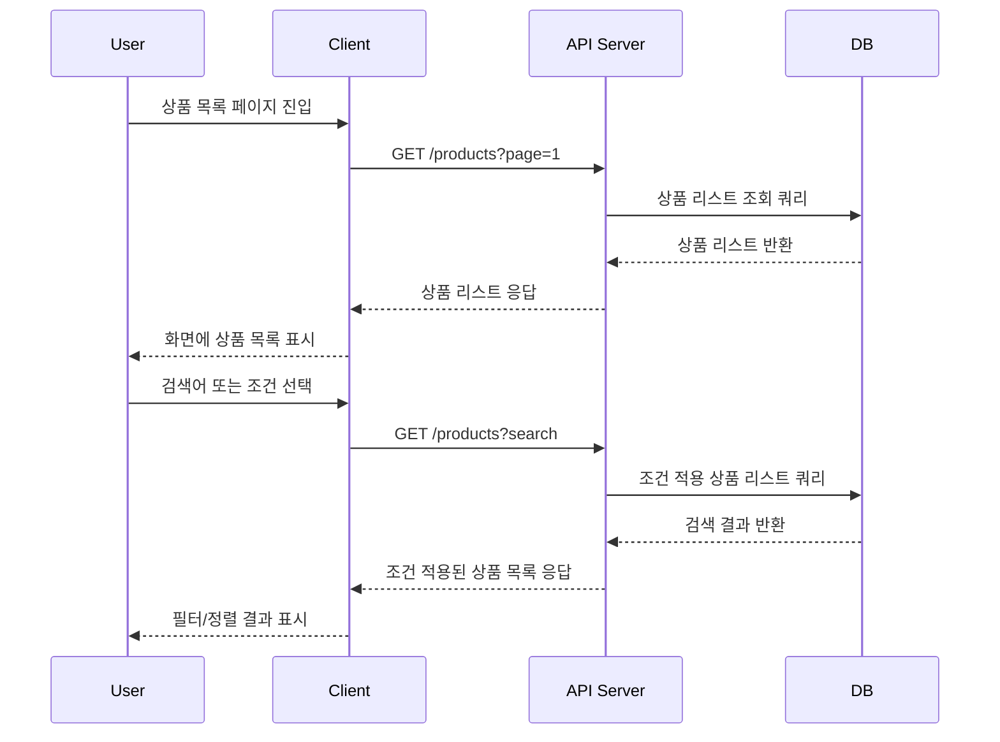
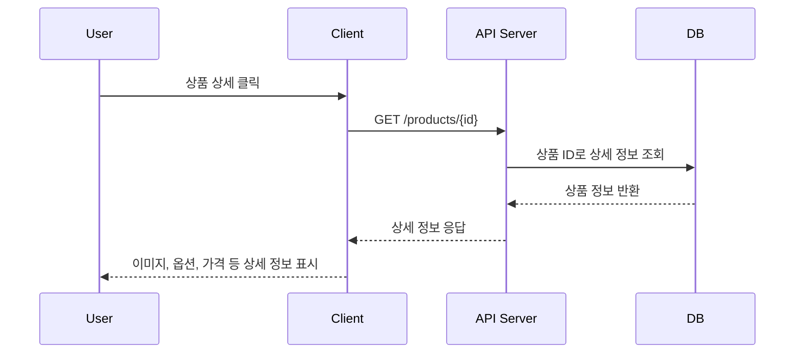
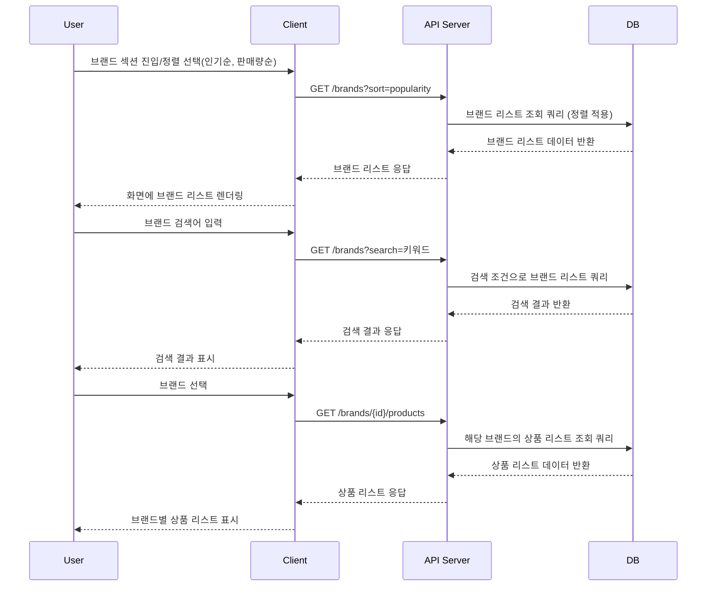
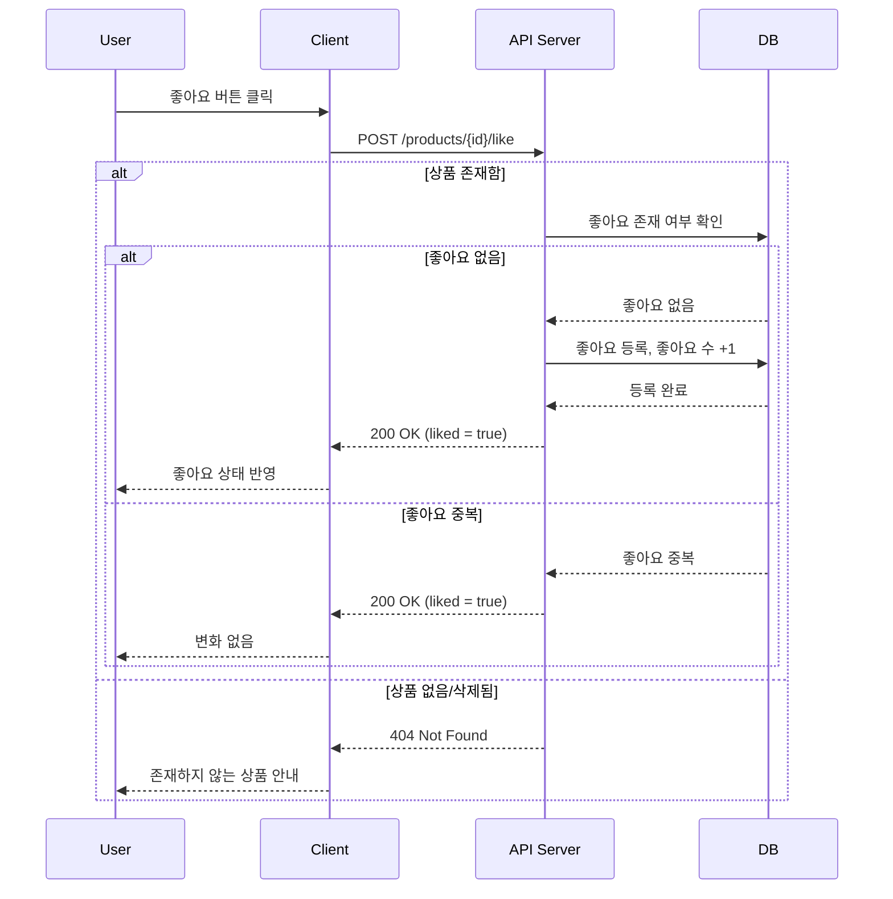
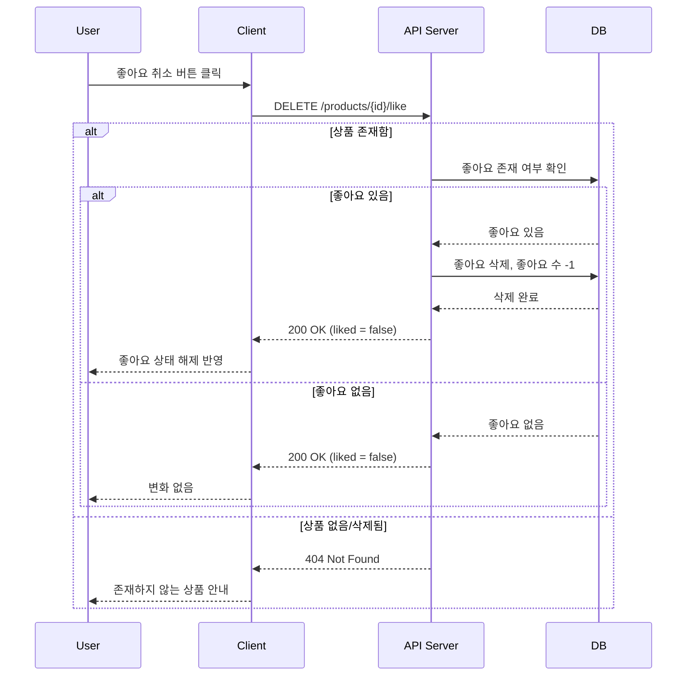
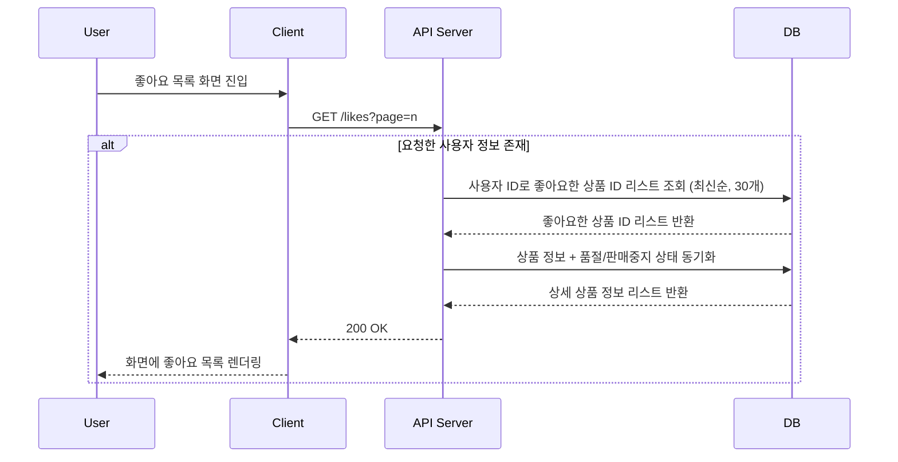
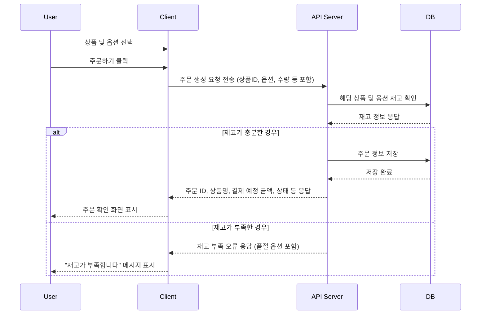
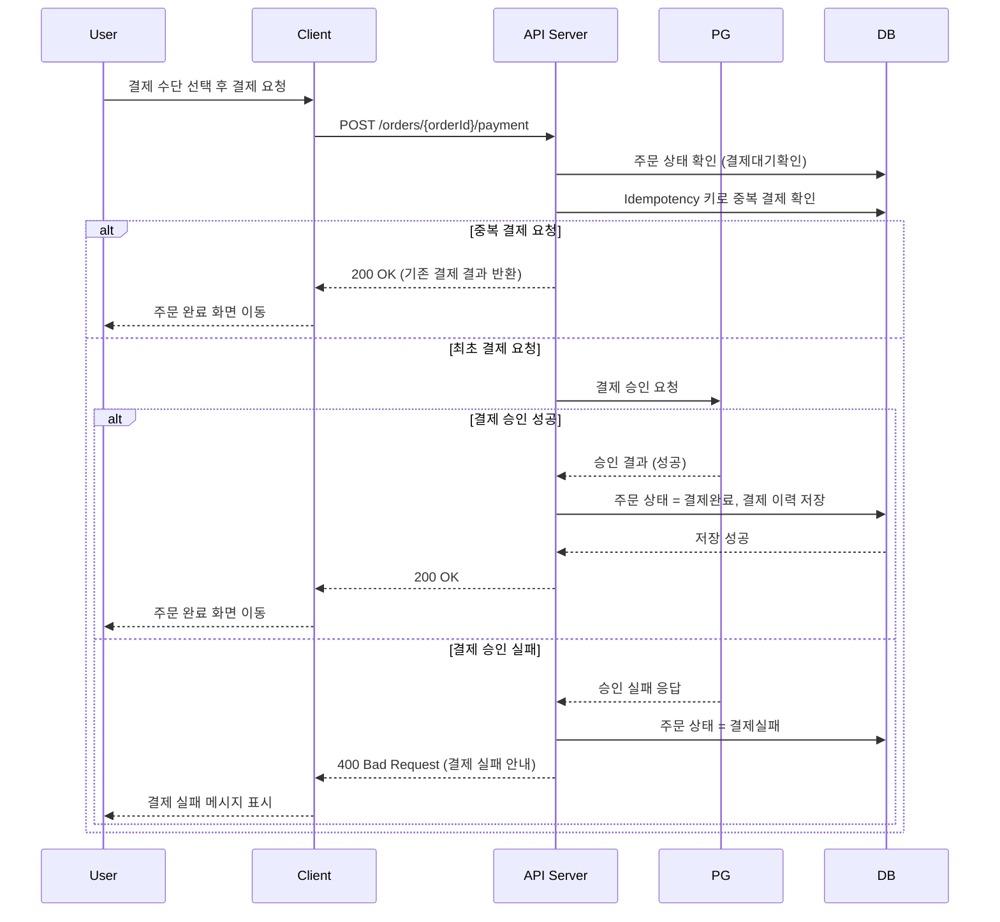
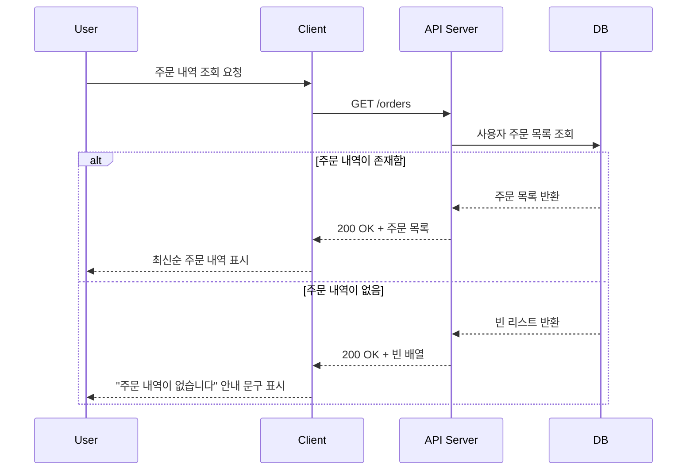

# 상품

## 상품 목록 조회

```mermaid
sequenceDiagram
    participant User
    participant Client
    participant API Server
    participant DB

    %% 1. 상품 리스트 초기 조회 
    User->>Client: 상품 목록 페이지 진입
    Client->>API Server: GET /products?page=1
    API Server->>DB: 상품 리스트 조회 쿼리
    DB-->>API Server: 상품 리스트 반환
    API Server-->>Client: 상품 리스트 응답
    Client-->>User: 화면에 상품 목록 표시

    %% 2. 검색 및 조건 적용 
    User->>Client: 검색어 또는 조건 선택
    Client->>API Server: GET /products?search
    API Server->>DB: 조건 적용 상품 리스트 쿼리
    DB-->>API Server: 검색 결과 반환
    API Server-->>Client: 조건 적용된 상품 목록 응답
    Client-->>User: 필터/정렬 결과 표시

```

## 상품 상세 조회

```mermaid
sequenceDiagram
    participant User
    participant Client
    participant API Server
    participant DB

    %% 상품 상세 정보 조회
    User->>Client: 상품 상세 클릭
    Client->>API Server: GET /products/{id}
    API Server->>DB: 상품 ID로 상세 정보 조회
    DB-->>API Server: 상품 정보 반환
    API Server-->>Client: 상세 정보 응답
    Client-->>User: 이미지, 옵션, 가격 등 상세 정보 표시

```

---

# 브랜드

## 브랜드 리스트 조회

```mermaid
sequenceDiagram
    participant User
    participant Client
    participant API Server
    participant DB

    %% 1. 브랜드 리스트 조회
    User->>Client: 브랜드 섹션 진입/정렬 선택(인기순, 판매량순)
    Client->>API Server: GET /brands?sort=popularity
    API Server->>DB: 브랜드 리스트 조회 쿼리 (정렬 적용)
    DB-->>API Server: 브랜드 리스트 데이터 반환
    API Server-->>Client: 브랜드 리스트 응답
    Client-->>User: 화면에 브랜드 리스트 렌더링

    %% 2. 브랜드 검색
    User->>Client: 브랜드 검색어 입력
    Client->>API Server: GET /brands?search=키워드
    API Server->>DB: 검색 조건으로 브랜드 리스트 쿼리
    DB-->>API Server: 검색 결과 반환
    API Server-->>Client: 검색 결과 응답 
    Client-->>User: 검색 결과 표시

    %% 3. 브랜드별 상품 리스트 조회
    User->>Client: 브랜드 선택
    Client->>API Server: GET /brands/{id}/products
    API Server->>DB: 해당 브랜드의 상품 리스트 조회 쿼리
    DB-->>API Server: 상품 리스트 데이터 반환
    API Server-->>Client: 상품 리스트 응답 
    Client-->>User: 브랜드별 상품 리스트 표시

```

---

# 좋아요

## 좋아요 등록

```mermaid
sequenceDiagram
    participant User
    participant Client
    participant API Server
    participant DB

    %% 좋아요 등록 요청
    User->>Client: 좋아요 버튼 클릭
    Client->>API Server: POST /products/{id}/like

    alt 상품 존재함
        API Server->>DB: 좋아요 존재 여부 확인
        alt 좋아요 없음
            DB-->>API Server: 좋아요 없음
            API Server->>DB: 좋아요 등록, 좋아요 수 +1
            DB-->>API Server: 등록 완료
            API Server-->>Client: 200 OK (liked = true)
            Client-->>User: 좋아요 상태 반영
        else 좋아요 중복
            DB-->>API Server: 좋아요 중복
            API Server-->>Client: 200 OK (liked = true)
            Client-->>User: 변화 없음 
        end
    else 상품 없음/삭제됨
        API Server-->>Client: 404 Not Found
        Client-->>User: 존재하지 않는 상품 안내
    end

```

## 좋아요 취소

```mermaid
sequenceDiagram
    participant User
    participant Client
    participant API Server
    participant DB

    %% 좋아요 취소 요청
    User->>Client: 좋아요 취소 버튼 클릭
    Client->>API Server: DELETE /products/{id}/like

    alt 상품 존재함
        API Server->>DB: 좋아요 존재 여부 확인
        alt 좋아요 있음
            DB-->>API Server: 좋아요 있음
            API Server->>DB: 좋아요 삭제, 좋아요 수 -1
            DB-->>API Server: 삭제 완료
            API Server-->>Client: 200 OK (liked = false)
            Client-->>User: 좋아요 상태 해제 반영
        else 좋아요 없음 
            DB-->>API Server: 좋아요 없음
            API Server-->>Client: 200 OK (liked = false)
            Client-->>User: 변화 없음 
        end
    else 상품 없음/삭제됨
        API Server-->>Client: 404 Not Found
        Client-->>User: 존재하지 않는 상품 안내
    end

```

## 좋아요 리스트 조회

```mermaid
sequenceDiagram
    participant User
    participant Client
    participant API Server
    participant DB

    User->>Client: 좋아요 목록 화면 진입
    Client->>API Server: GET /likes?page=n

    alt 요청한 사용자 정보 존재
        API Server->>DB: 사용자 ID로 좋아요한 상품 ID 리스트 조회 (최신순, 30개)
        DB-->>API Server: 좋아요한 상품 ID 리스트 반환

        API Server->>DB: 상품 정보 + 품절/판매중지 상태 동기화
        DB-->>API Server: 상세 상품 정보 리스트 반환

        API Server-->>Client: 200 OK 
        Client-->>User: 화면에 좋아요 목록 렌더링
    end

```

---

# 주문

## 주문 등록 요청

```mermaid
sequenceDiagram
    participant User
    participant Client
    participant API Server
    participant DB

    %% 1. 상품 선택 및 주문 요청
    User->>Client: 상품 및 옵션 선택
    User->>Client: 주문하기 클릭
    Client->>API Server: 주문 생성 요청 전송 (상품ID, 옵션, 수량 등 포함)

    %% 2. 재고 확인
    API Server->>DB: 해당 상품 및 옵션 재고 확인
    DB-->>API Server: 재고 정보 응답

    alt 재고가 충분한 경우
        API Server->>DB: 주문 정보 저장
        DB-->>API Server: 저장 완료
        API Server-->>Client: 주문 ID, 상품명, 결제 예정 금액, 상태 등 응답
        Client-->>User: 주문 확인 화면 표시

    else 재고가 부족한 경우
        API Server-->>Client: 재고 부족 오류 응답 (품절 옵션 포함)
        Client-->>User: "재고가 부족합니다" 메시지 표시
    end

```

# 결제

## 결제 요청

```mermaid
sequenceDiagram
    participant User
    participant Client
    participant API Server
    participant PG
    participant DB

    User->>Client: 결제 수단 선택 후 결제 요청
    Client->>API Server: POST /orders/{orderId}/payment

    API Server->>DB: 주문 상태 확인 (결제대기확인)
    API Server->>DB: Idempotency 키로 중복 결제 확인

    alt 중복 결제 요청
        API Server-->>Client: 200 OK (기존 결제 결과 반환)
        Client-->>User: 주문 완료 화면 이동
    else 최초 결제 요청
        API Server->>PG: 결제 승인 요청

        alt 결제 승인 성공
            PG-->>API Server: 승인 결과 (성공)
            API Server->>DB: 주문 상태 = 결제완료, 결제 이력 저장
            DB-->>API Server: 저장 성공
            API Server-->>Client: 200 OK
            Client-->>User: 주문 완료 화면 이동
        else 결제 승인 실패
            PG-->>API Server: 승인 실패 응답
            API Server->>DB: 주문 상태 = 결제실패
            API Server-->>Client: 400 Bad Request (결제 실패 안내)
            Client-->>User: 결제 실패 메시지 표시
        end
    end

```

## 주문 목록 조회

```mermaid
sequenceDiagram
    participant User
    participant Client
    participant API_Server as API Server
    participant DB 

    User->>Client: 주문 내역 조회 요청
    Client->>API_Server: GET /orders

    API_Server->>DB: 사용자 주문 목록 조회

    alt 주문 내역이 존재함
        DB-->>API_Server: 주문 목록 반환
        API_Server-->>Client: 200 OK + 주문 목록
        Client-->>User: 최신순 주문 내역 표시
    else 주문 내역이 없음
        DB-->>API_Server: 빈 리스트 반환
        API_Server-->>Client: 200 OK + 빈 배열
        Client-->>User: "주문 내역이 없습니다" 안내 문구 표시
    end

```
