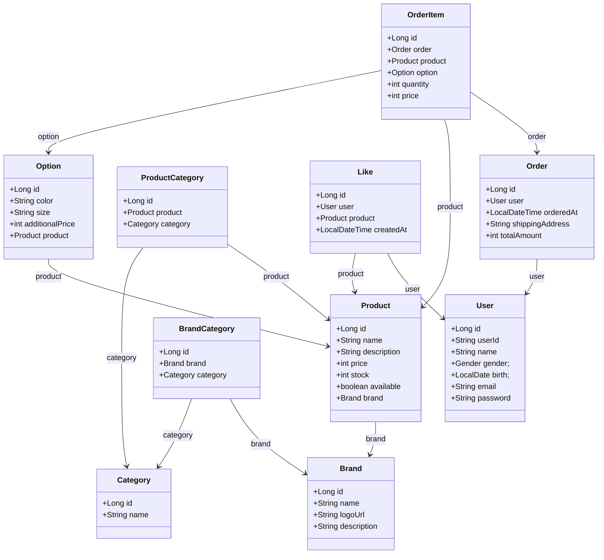

## 클래스 다이어그램

```mermaid
classDiagram

class Product {
  +Long id
  +String name
  +String description
  +int price
  +int stock
  +boolean available
  +Brand brand
}

class Option {
  +Long id
  +String color
  +String size
  +int additionalPrice
  +Product product
}

class Brand {
  +Long id
  +String name
  +String logoUrl
  +String description
}

class Category {
  +Long id
  +String name
}

class ProductCategory {
  +Long id
  +Product product
  +Category category
}

class BrandCategory {
  +Long id
  +Brand brand
  +Category category
}

class Like {
  +Long id
  +User user
  +Product product
  +LocalDateTime createdAt
}

class Order {
  +Long id
  +User user
  +LocalDateTime orderedAt
  +String shippingAddress
  +int totalAmount
}

class OrderItem {
  +Long id
  +Order order
  +Product product
  +Option option
  +int quantity
  +int price
}

class User {
  +Long id
  +String userId
  +String name
  +Gender gender;
  +LocalDate birth;
  +String email
  +String password
  
}

Option --> Product : product

Product --> Brand : brand
ProductCategory --> Product : product
ProductCategory --> Category : category

BrandCategory --> Brand : brand
BrandCategory --> Category : category

Like --> User : user
Like --> Product : product

Order --> User : user
OrderItem --> Order : order
OrderItem --> Product : product
OrderItem --> Option : option

```
