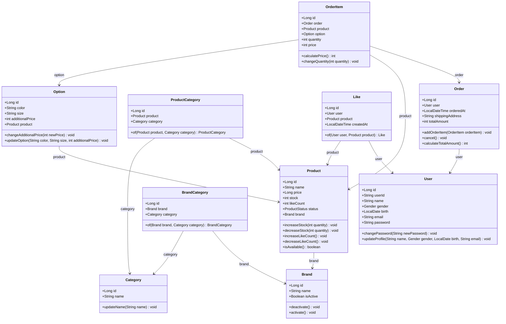

## 클래스 다이어그램

```mermaid
classDiagram

class Product {
  +Long id
  +String name
  +Long price
  +int stock
  +int likeCount
  +ProductStatus status
  +Brand brand

  +increaseStock(int quantity) void
  +decreaseStock(int quantity) void
  +increaseLikeCount() void
  +decreaseLikeCount() void
  +isAvailable() boolean
}

class Option {
  +Long id
  +String color
  +String size
  +int additionalPrice
  +Product product

  +changeAdditionalPrice(int newPrice) void
  +updateOption(String color, String size, int additionalPrice) void
}

class Brand {
  +Long id
  +String name
  +Boolean isActive

  +deactivate() void
  +activate() void
}

class Category {
  +Long id
  +String name

  +updateName(String name) void
}

class ProductCategory {
  +Long id
  +Product product
  +Category category

  +of(Product product, Category category) ProductCategory
}

class BrandCategory {
  +Long id
  +Brand brand
  +Category category

  +of(Brand brand, Category category) BrandCategory
}

class Like {
  +Long id
  +User user
  +Product product
  +LocalDateTime createdAt

  +of(User user, Product product) Like
}

class Order {
  +Long id
  +User user
  +LocalDateTime orderedAt
  +String shippingAddress
  +int totalAmount

  +addOrderItem(OrderItem orderItem) void
  +cancel() void
  +calculateTotalAmount() int
}

class OrderItem {
  +Long id
  +Order order
  +Product product
  +Option option
  +int quantity
  +int price

  +calculatePrice() int
  +changeQuantity(int quantity) void
}

class User {
  +Long id
  +String userId
  +String name
  +Gender gender
  +LocalDate birth
  +String email
  +String password

  +changePassword(String newPassword) void
  +updateProfile(String name, Gender gender, LocalDate birth, String email) void
}

Option --> Product : product

Product --> Brand : brand
ProductCategory --> Product : product
ProductCategory --> Category : category

BrandCategory --> Brand : brand
BrandCategory --> Category : category

Like --> User : user
Like --> Product : product

Order --> User : user
OrderItem --> Order : order
OrderItem --> Product : product
OrderItem --> Option : option

```
