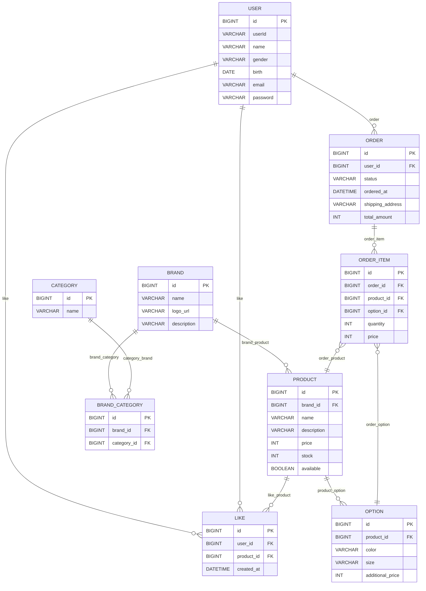
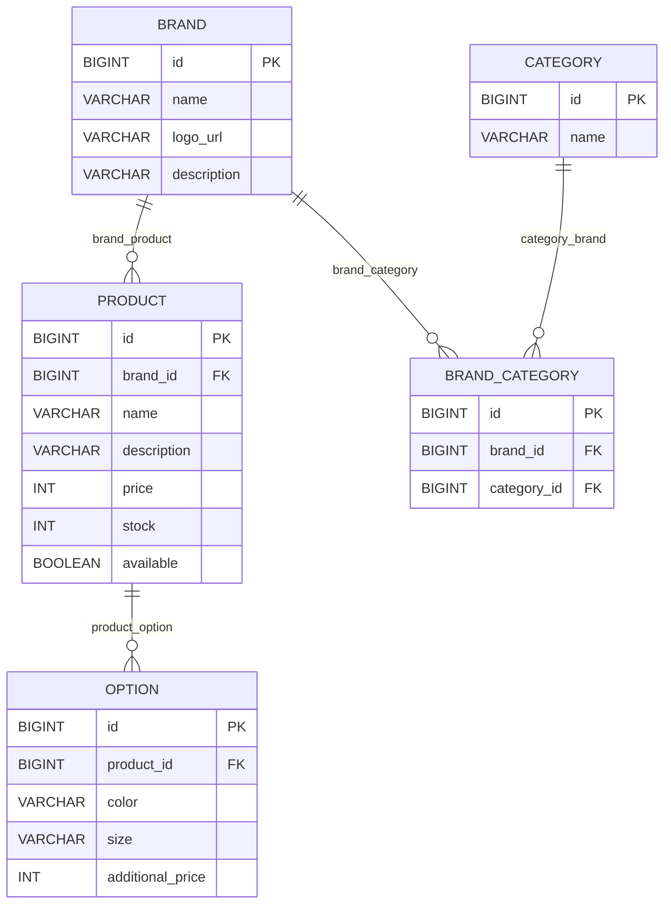
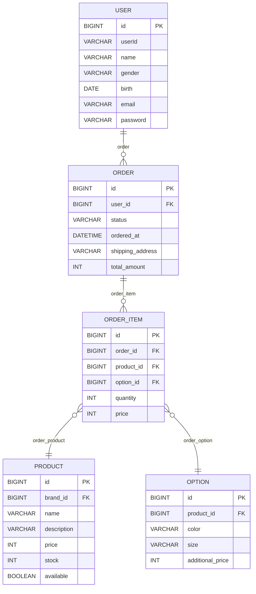
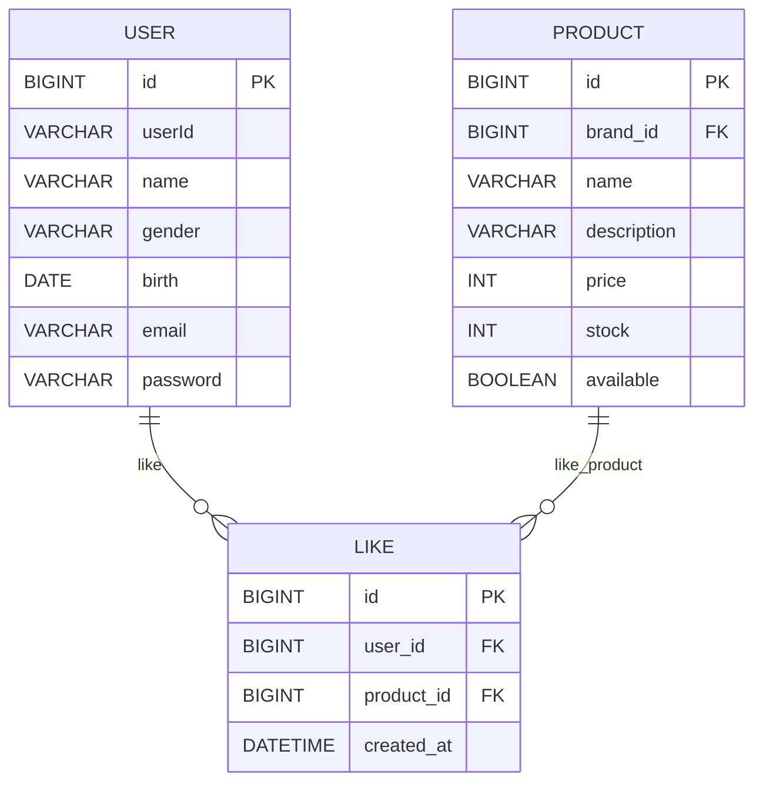
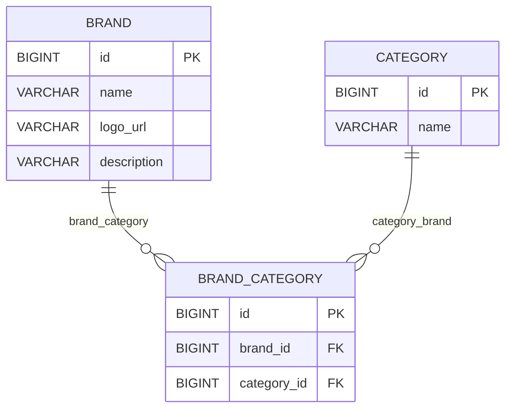

# 전체 ERD

 
<strong>보기</strong>

```mermaid
erDiagram
    USER {
        BIGINT id PK
        VARCHAR userId
        VARCHAR name
        VARCHAR gender
        DATE birth
        VARCHAR email
        VARCHAR password
        
    }
    PRODUCT {
        BIGINT id PK
        BIGINT brand_id FK
        VARCHAR name
        VARCHAR description
        INT price
        INT stock
        BOOLEAN available
    }
    OPTION {
        BIGINT id PK
        BIGINT product_id FK
        VARCHAR color
        VARCHAR size
        INT additional_price
    }
    BRAND {
        BIGINT id PK
        VARCHAR name
        VARCHAR logo_url
        VARCHAR description
    }
    CATEGORY {
        BIGINT id PK
        VARCHAR name
    }
    BRAND_CATEGORY {
        BIGINT id PK
        BIGINT brand_id FK
        BIGINT category_id FK
    }
    "LIKE" {
        BIGINT id PK
        BIGINT user_id FK
        BIGINT product_id FK
        DATETIME created_at
    }
    "ORDER" {
        BIGINT id PK
        BIGINT user_id FK
        VARCHAR status
        DATETIME ordered_at
        VARCHAR shipping_address
        INT total_amount
    }
    ORDER_ITEM {
        BIGINT id PK
        BIGINT order_id FK
        BIGINT product_id FK
        BIGINT option_id FK
        INT quantity
        INT price
    }

    USER ||--o{ "ORDER" : order
    USER ||--o{ "LIKE" : like
    "ORDER" ||--o{ ORDER_ITEM : order_item
    USER ||--o{ "LIKE" : like
    PRODUCT ||--o{ "LIKE" : like_product
    PRODUCT ||--o{ OPTION : product_option
    BRAND ||--o{ PRODUCT : brand_product
    BRAND ||--o{ BRAND_CATEGORY : brand_category
    CATEGORY ||--o{ BRAND_CATEGORY : category_brand
    ORDER_ITEM }o--|| PRODUCT : order_product
    ORDER_ITEM }o--|| OPTION : order_option

```

# 상품 도메인 ERD

 
<strong>보기</strong>

```mermaid
erDiagram
    PRODUCT {
        BIGINT id PK
        BIGINT brand_id FK
        VARCHAR name
        VARCHAR description
        INT price
        INT stock
        BOOLEAN available
    }
    OPTION {
        BIGINT id PK
        BIGINT product_id FK
        VARCHAR color
        VARCHAR size
        INT additional_price
    }
    BRAND {
        BIGINT id PK
        VARCHAR name
        VARCHAR logo_url
        VARCHAR description
    }
    CATEGORY {
        BIGINT id PK
        VARCHAR name
    }
    BRAND_CATEGORY {
        BIGINT id PK
        BIGINT brand_id FK
        BIGINT category_id FK
    }

    PRODUCT ||--o{ OPTION : product_option
    BRAND ||--o{ PRODUCT : brand_product
    BRAND ||--o{ BRAND_CATEGORY : brand_category
    CATEGORY ||--o{ BRAND_CATEGORY : category_brand

```

# 주문 도메인 ERD

 
<strong>보기</strong>

```mermaid
erDiagram
    USER {
        BIGINT id PK
        VARCHAR userId
        VARCHAR name
        VARCHAR gender
        DATE birth
        VARCHAR email
        VARCHAR password
    }
    "ORDER" {
        BIGINT id PK
        BIGINT user_id FK
        VARCHAR status
        DATETIME ordered_at
        VARCHAR shipping_address
        INT total_amount
    }
    ORDER_ITEM {
        BIGINT id PK
        BIGINT order_id FK
        BIGINT product_id FK
        BIGINT option_id FK
        INT quantity
        INT price
    }
    PRODUCT {
        BIGINT id PK
        BIGINT brand_id FK
        VARCHAR name
        VARCHAR description
        INT price
        INT stock
        BOOLEAN available
    }
    OPTION {
        BIGINT id PK
        BIGINT product_id FK
        VARCHAR color
        VARCHAR size
        INT additional_price
    }

    USER ||--o{ "ORDER" : order
    "ORDER" ||--o{ ORDER_ITEM : order_item
    ORDER_ITEM }o--|| PRODUCT : order_product
    ORDER_ITEM }o--|| OPTION : order_option

```

# 좋아요 도메인 ERD

 
<strong>보기</strong>

```mermaid
erDiagram
    USER {
        BIGINT id PK
        VARCHAR userId
        VARCHAR name
        VARCHAR gender
        DATE birth
        VARCHAR email
        VARCHAR password
    }
    "LIKE" {
        BIGINT id PK
        BIGINT user_id FK
        BIGINT product_id FK
        DATETIME created_at
    }
    PRODUCT {
        BIGINT id PK
        BIGINT brand_id FK
        VARCHAR name
        VARCHAR description
        INT price
        INT stock
        BOOLEAN available
    }

    USER ||--o{ "LIKE" : like
    PRODUCT ||--o{ "LIKE" : like_product

```

# 브랜드-카테고리 도메인 ERD

 
<strong>보기</strong>

  

```mermaid
erDiagram
    BRAND {
        BIGINT id PK
        VARCHAR name
        VARCHAR logo_url
        VARCHAR description
    }
    CATEGORY {
        BIGINT id PK
        VARCHAR name
    }
    BRAND_CATEGORY {
        BIGINT id PK
        BIGINT brand_id FK
        BIGINT category_id FK
    }

    BRAND ||--o{ BRAND_CATEGORY : brand_category
    CATEGORY ||--o{ BRAND_CATEGORY : category_brand

```

